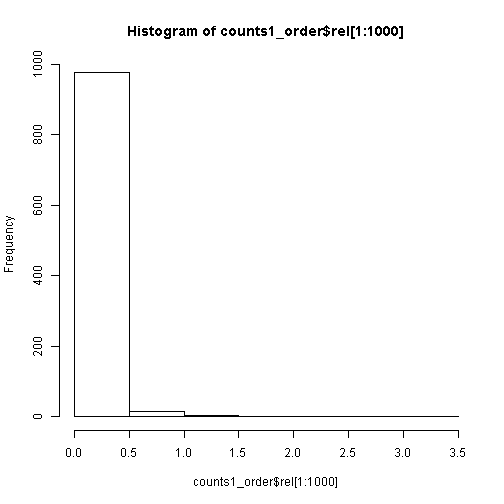
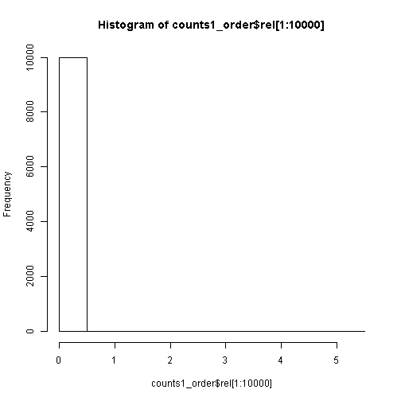
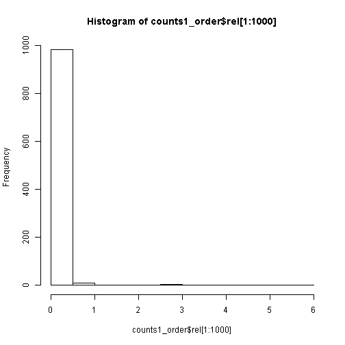

## Exploratory Analysis 

# (Getting and cleaning)


First step of the exploratory analysis is getting a sample of each of the sets and cleaning it.
For this purpose, the following iterative process has been followed:


- Reading a bunch of lines from the original file (randomly decide if use it or not, for sampling)
- Tokenizing each line, getting each separate "word"
- Cleaning each "word" using "regular expresions" (numbers, special characters...)
- Unifying lower and upper case
- Reading another bunch of lines (back to Step1)

--- .class #id 

## Exploratory Analysis 

# (Summarizing)

Once the text is in a tokenized and cleaned format, a N-grams approach is used to summarized the information.

- 1-grams: Single word appareances are counted
- 2-grams: Exact pairs of words are counted
- 3-grams: Exact 3-word groups are counted 

--- .class #id 

## First results

# Twitter set

- English language Twitter training set has:
- A size of 163Mb
- 2,360,148 lines
- 30,373,583 words
- The longest line has 213 characters and the shortest one, just 2 characters
- The table is an example of the more common words and their relative frequency


```
##      word1   rel
## 3005   the 3.173
## 3072    to 2.684
## 1443     i 2.417
## 8        a 2.062
## 3484   you 1.837
```


--- .class #id 

# Twitter set

- A quick look to the 1,000 more common words indicates a long tail distribution, so probably, a small subset of the words will be able to represent a big part of the total text

 


--- .class #id 

## First results

# Blogs set

- English language Twitter training set has:
- A size of 205Mb
- 899,299 lines
- 37,334,131 words
- The longest line has 40,835 characters and the shortest one, just 1 character
- The table is an example of the more common words and their relative frequency


```
##      word1   rel
## 7203   the 5.010
## 270    and 2.938
## 7316    to 2.904
## 16       a 2.440
## 4900    of 2.343
```

 


--- .class #id 

# Blogs set

- Even if we look at the 10,000 more common words, it indicates a long tail distribution, so probably, a small subset of the words will be able to represent a big part of the total text

 


--- .class #id 

## First results

# News set

- English language Twitter training set has:
- A size of 201Mb
- 1,010,243 lines
- 34,372,530 words
- The longest line has 11,384 characters and the shortest one, just 1 character
- The table is an example of the more common words and their relative frequency


```
##      word1   rel
## 6965   the 5.904
## 7076    to 2.751
## 11       a 2.636
## 277    and 2.611
## 4762    of 2.324
```

 


--- .class #id

# News set

- Again, the news training set has a similar long-tail word distribution

 


--- .class #id

## Next Steps

- Putting together the N-grams analysis from each source
- First predictive approach will just be based on more frequent N-grams
- Example: If "The White House" appears 10 times on the training set and "The White Sox" appears 8 times on the training set, then If the app input is "The white", the output will be "House" (and not "Sox")
- Memory occupation and velocity should also be taken into consideration


